# The Gateway board and components

At the moment there is only one playable copy of the game. The one Tim and I
built over a weekend.

## Version 2 (current)

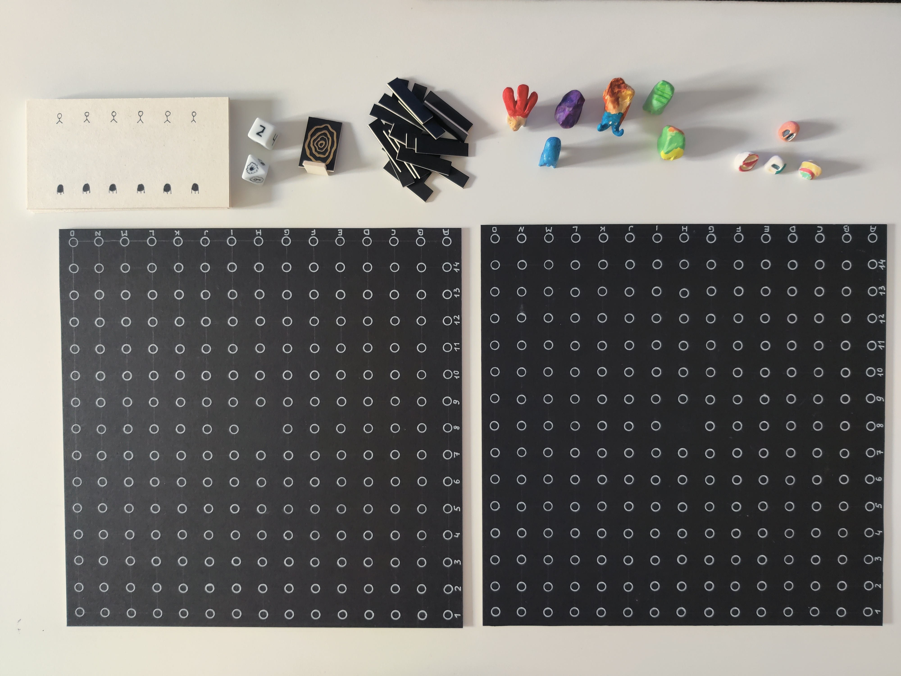

All components of the game.

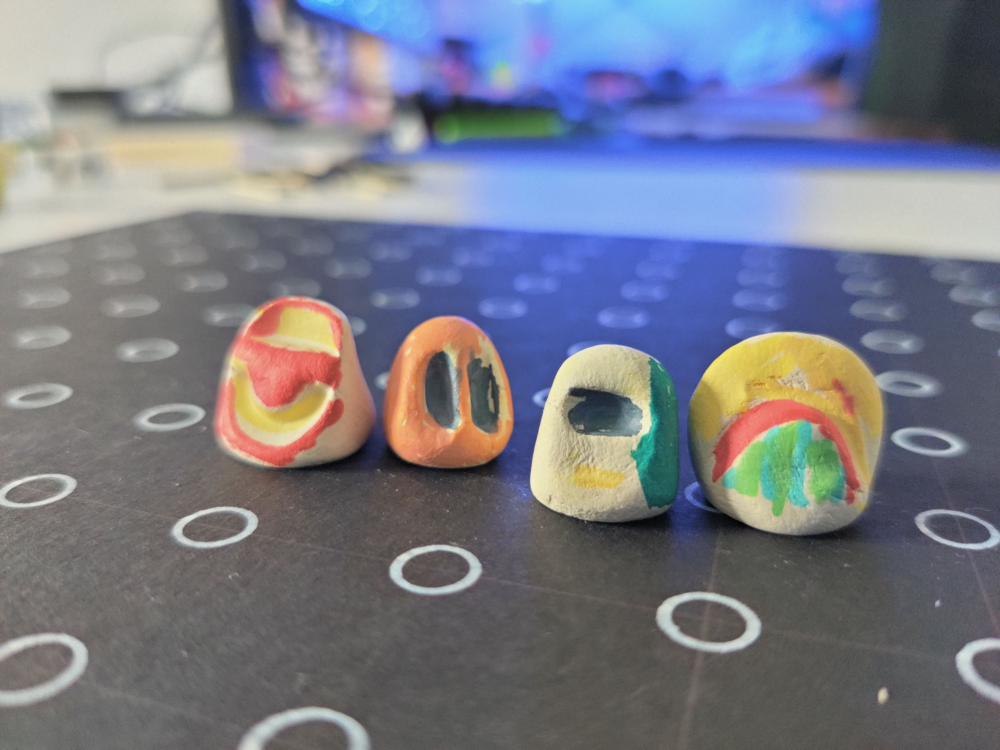

Player characters.

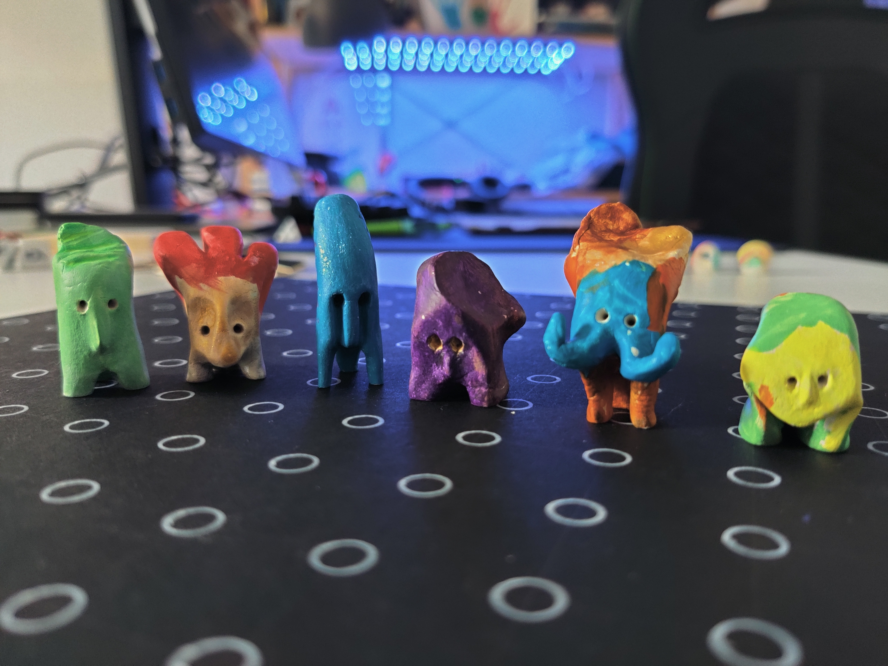

Creature characters.

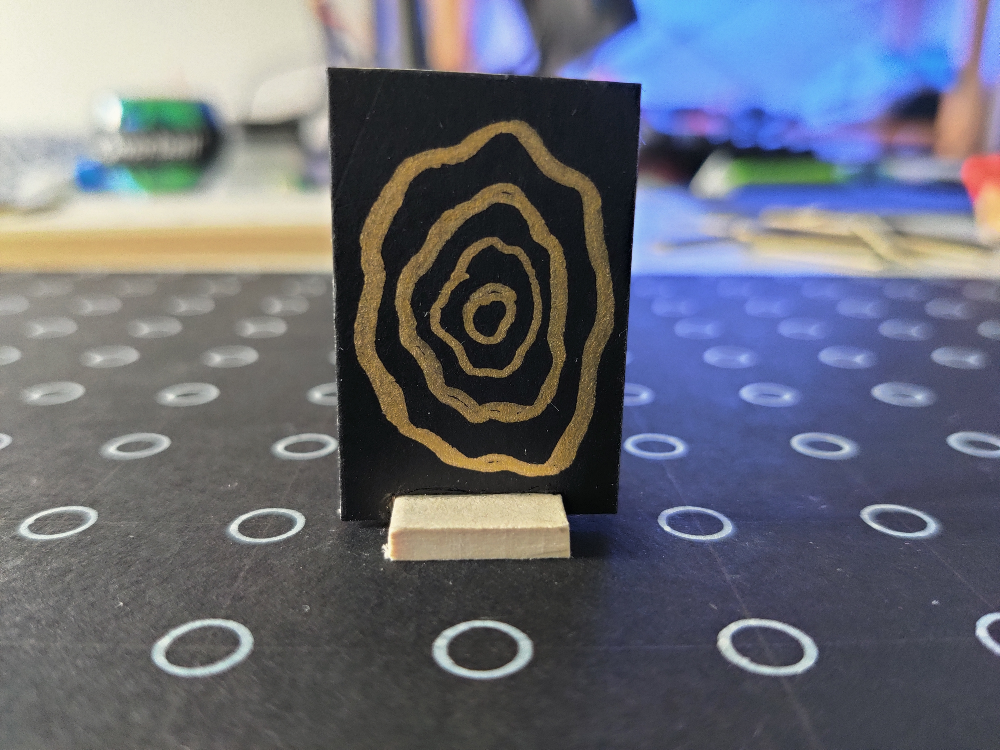

The portal.

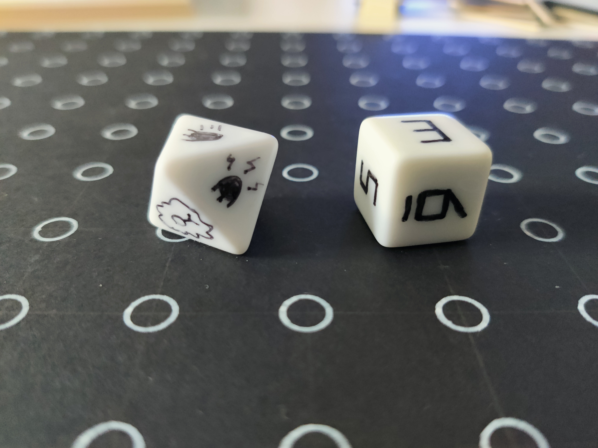

D8 and D6 dice.

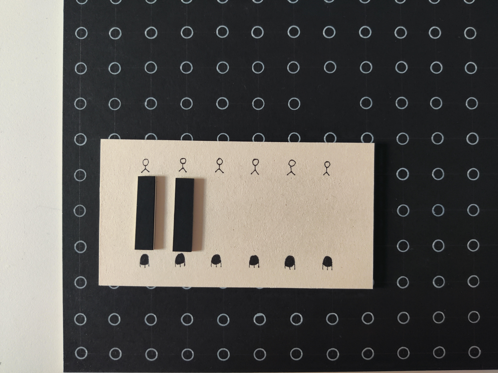

A score and tokens.

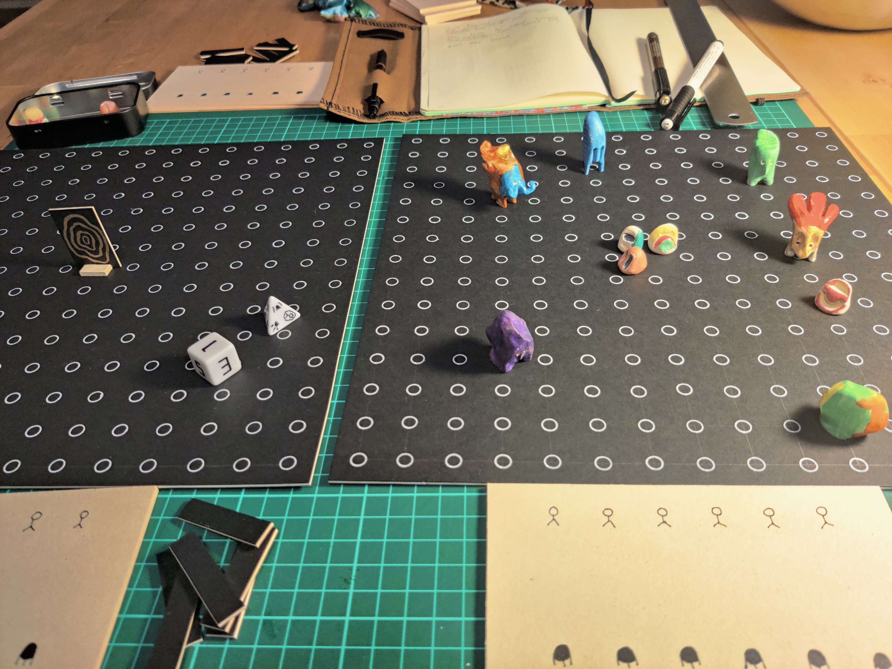

A game session :smile:

## Version 1 (prototype)

A quick prototype took a couple hours to build, but it was wobbly and
therefore hard to play.

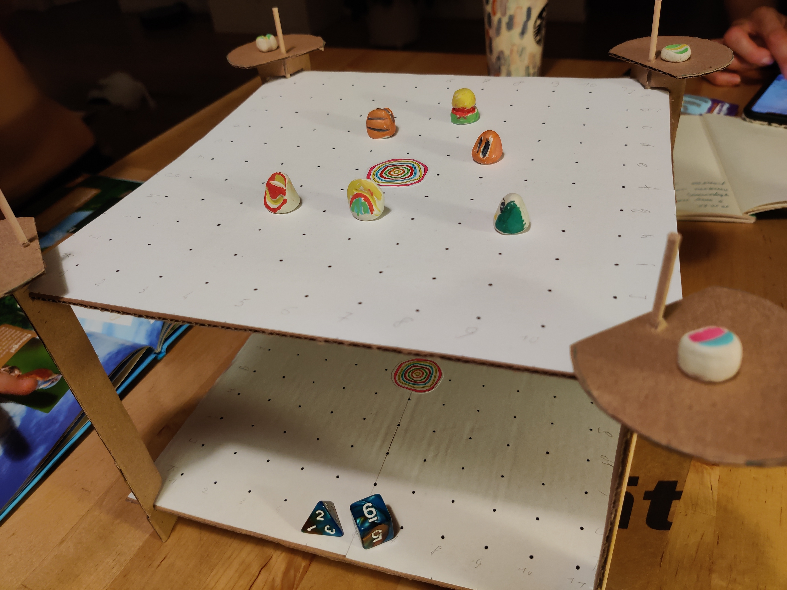

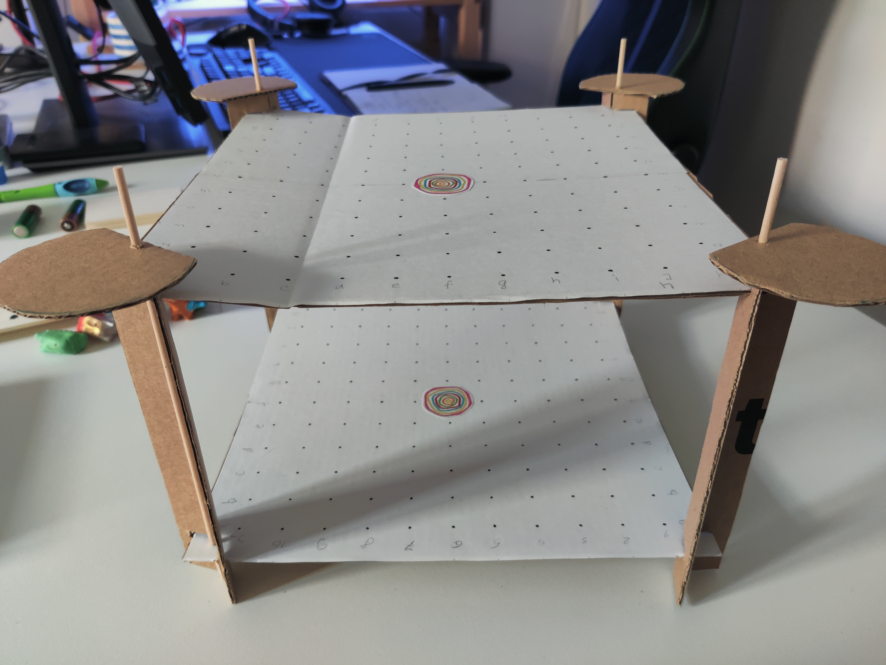

Two parallel worlds.

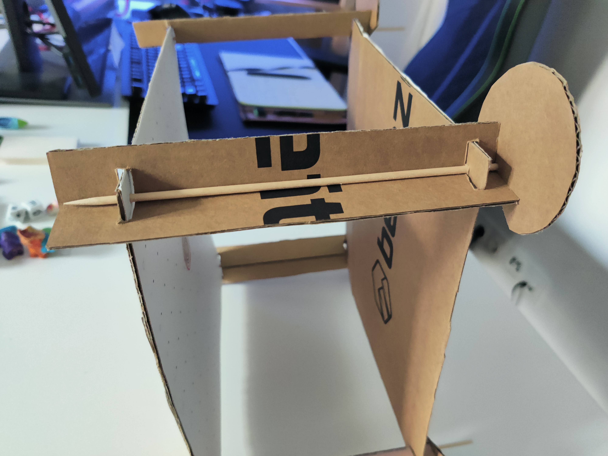

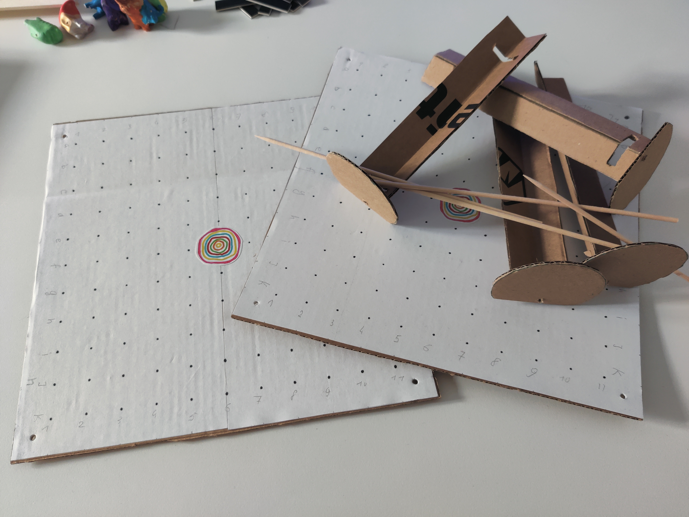

It was designed to be foldable.
